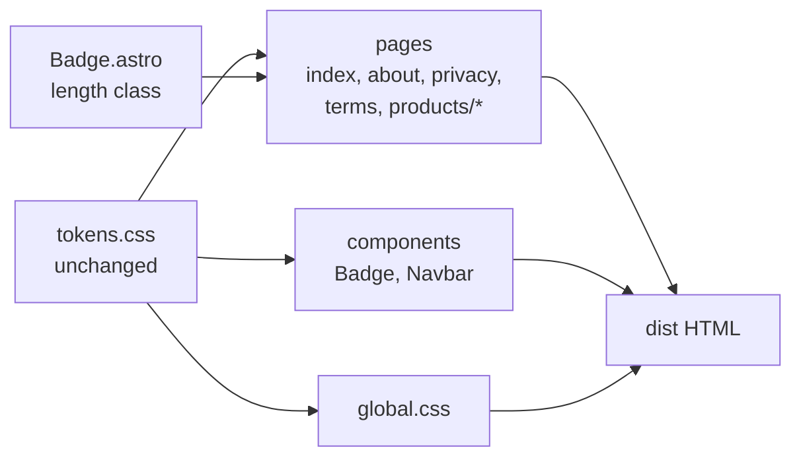

# Design Document

## Overview

This design covers four small, CSS-level fixes on the Naruka AI Labs Astro site. The issue numbers match `requirements.md`.

1. Type scale: replace every hardcoded `rem` and `clamp()` font size with a `--font-size-*` token, and collapse the token usage to 10 distinct sizes.
2. Corner radii: replace raw `2px` and `3px` radii with `var(--radius-xs)`. Keep `50%` on true circles.
3. Hero badge casing: `Badge.astro` picks uppercase or mixed case from the label length.
4. Product tagline casing: `.card-tagline` drops forced uppercase and wide tracking, and the two taglines are written in sentence case.

No new files, dependencies or runtime logic are added. `src/styles/tokens.css` is not edited. The only logic is one length comparison in `Badge.astro`.

### Scope of change

| File | Issue | Change |
| --- | --- | --- |
| `src/pages/index.astro` | 1, 2, 4 | font sizes, one `50%` kept, one `3px` radius, `.card-tagline` rule, two tagline strings |
| `src/pages/about/index.astro` | 1 | one `clamp()` |
| `src/pages/privacy/index.astro` | 1, 2 | 5 font sizes, one `clamp()`, one `3px` radius |
| `src/pages/terms/index.astro` | 1, 2 | 5 font sizes, one `clamp()`, one `3px` radius |
| `src/pages/products/index.astro` | 1 | 9 font sizes |
| `src/pages/products/field-book/index.astro` | 1, 2 | font sizes, one `clamp()`, one `3px` radius, one `50%` kept |
| `src/pages/products/setu/index.astro` | 1, 2 | font sizes, one `clamp()`, one `3px` radius, one `50%` kept |
| `src/components/Navbar.astro` | 1, 2 | `--font-size-xl` to `--font-size-lg`, one `2px` radius |
| `src/styles/global.css` | 1 | `h6` from `--font-size-xl` to `--font-size-lg` |
| `src/components/Badge.astro` | 3 | length class and casing rules |

All other files already use tokens only and stay unchanged.

## Architecture

The site is statically built by Astro, and all four fixes live in scoped `<style>` blocks, `global.css`, or Astro frontmatter. The Token_File stays the single source of values.



Verification reads the source files and the built HTML in `dist/`. There is no test runner in the project, and none is added.

## Components and Interfaces

### Issue 1: Type scale

#### Token consolidation decision

Before this change the Astro_Source references 11 distinct resolved sizes through tokens (`xs`, `sm`, `base`/`md`, `lg`, `xl`, `2xl`, `3xl`, `4xl`, `5xl`, `6xl`, `7xl`). The 22 hardcoded `rem` sizes would map onto the same set, so the limit of 10 cannot be met by replacing hardcoded values alone.

Decision: stop referencing `--font-size-xl` (19px) in the Astro_Source and use `--font-size-lg` (18px) in its place.

Why `xl`:

- `lg` (18px), `xl` (19px) and `md` (17px) are within 2px of each other, so criterion 1.6 permits dropping one.
- `xl` has only two references (`Navbar.astro` mobile nav link and `global.css` `h6`). Dropping `lg` would touch about ten references.
- The shift is 1px. The heading order stays intact: `h5` is 17px (`md`) and `h6` becomes 18px (`lg`), the same relative order as before (17 and 19).

The token `--font-size-xl` stays defined in the Token_File (requirement 1.7) and is simply unreferenced.

Final set of 10 distinct sizes:

| # | Token | Resolved value |
| --- | --- | --- |
| 1 | `--font-size-xs` | 12px |
| 2 | `--font-size-sm` | 14px |
| 3 | `--font-size-base` / `--font-size-md` | 17px (counts once) |
| 4 | `--font-size-lg` | 18px |
| 5 | `--font-size-2xl` | 21px |
| 6 | `--font-size-3xl` | 25.5px |
| 7 | `--font-size-4xl` | 28px |
| 8 | `--font-size-5xl` | fluid, 21px to 36px |
| 9 | `--font-size-6xl` | fluid, 25.5px to 48px |
| 10 | `--font-size-7xl` | fluid, 28px to 60px |

The smallest value is 12px, so criterion 1.3 holds. The fluid minimums are 21px, 25.5px and 28px.

#### Rem-to-token mapping

Rule: pick the token with the closest value from the final set above. Where two tokens are equally close, pick the larger one so that small text does not shrink. Sizes with no token within 2px take the nearest token (only `2rem`).

| Original | px | Token | Token px | Shift | Uses |
| --- | --- | --- | --- | --- | --- |
| `0.72rem` | 11.52 | `--font-size-xs` | 12 | +0.48 | 2 |
| `0.75rem` | 12 | `--font-size-xs` | 12 | 0 | 11 |
| `0.78rem` | 12.48 | `--font-size-xs` | 12 | -0.48 | 1 |
| `0.8rem` | 12.8 | `--font-size-xs` | 12 | -0.8 | 7 |
| `0.82rem` | 13.12 | `--font-size-sm` | 14 | +0.88 | 1 |
| `0.825rem` | 13.2 | `--font-size-sm` | 14 | +0.8 | 2 |
| `0.85rem` | 13.6 | `--font-size-sm` | 14 | +0.4 | 10 |
| `0.875rem` | 14 | `--font-size-sm` | 14 | 0 | 5 |
| `0.9rem` | 14.4 | `--font-size-sm` | 14 | -0.4 | 3 |
| `0.925rem` | 14.8 | `--font-size-sm` | 14 | -0.8 | 5 |
| `0.95rem` | 15.2 | `--font-size-sm` | 14 | -1.2 | 6 |
| `1rem` | 16 | `--font-size-md` | 17 | +1 | 3 |
| `1.05rem` | 16.8 | `--font-size-md` | 17 | +0.2 | 5 |
| `1.15rem` | 18.4 | `--font-size-lg` | 18 | -0.4 | 3 |
| `1.25rem` | 20 | `--font-size-2xl` | 21 | +1 | 5 |
| `1.35rem` | 21.6 | `--font-size-2xl` | 21 | -0.6 | 4 |
| `1.4rem` | 22.4 | `--font-size-2xl` | 21 | -1.4 | 1 |
| `1.5rem` | 24 | `--font-size-3xl` | 25.5 | +1.5 | 2 |
| `1.6rem` | 25.6 | `--font-size-3xl` | 25.5 | -0.1 | 1 |
| `1.75rem` | 28 | `--font-size-4xl` | 28 | 0 | 3 |
| `1.85rem` | 29.6 | `--font-size-4xl` | 28 | -1.6 | 1 |
| `2rem` | 32 | `--font-size-4xl` | 28 | -4 | 1 |

That is 22 distinct values and 82 declarations. Largest shift within 2px is 1.6px. `2rem` (the stat figure at `src/pages/index.astro` line 471) has no token within 2px, since the nearest discrete tokens are 28px and the fluid steps are not fixed sizes. It takes `--font-size-4xl`, which is a 4px reduction.

Tie handling check: `1.25rem` (20px) is 2px from `lg` (18px) and 1px from `2xl` (21px), so `2xl` is the strict nearest and no tie rule is needed. It was a tie only while `xl` (19px) remained in the set.

#### Existing token reference change

| Location | From | To | Shift |
| --- | --- | --- | --- |
| `Navbar.astro` `.mobile-nav-link` | `--font-size-xl` (19px) | `--font-size-lg` (18px) | -1px |
| `global.css` `h6` | `--font-size-xl` (19px) | `--font-size-lg` (18px) | -1px |

#### Clamp mapping

Rule from criterion 1.5: use the fluid token whose maximum is closest to the original maximum. Fluid maximums are 36px (`5xl`), 48px (`6xl`) and 60px (`7xl`).

| Original `clamp()` | Original max | Token | Token max | Used in |
| --- | --- | --- | --- | --- |
| `clamp(2.2rem, 4vw, 3.25rem)` | 52px | `--font-size-6xl` | 48px | `about/index.astro` |
| `clamp(2.2rem, 3.5vw, 3rem)` | 48px | `--font-size-6xl` | 48px | `privacy/index.astro`, `terms/index.astro` |
| `clamp(1.8rem, 3.2vw, 2.5rem)` | 40px | `--font-size-5xl` | 36px | `index.astro` `.section-title` |
| `clamp(1.8rem, 3.5vw, 2.5rem)` | 40px | `--font-size-5xl` | 36px | `index.astro` `.cta-heading` |
| `clamp(1.8rem, 3vw, 2.4rem)` | 38.4px | `--font-size-5xl` | 36px | `field-book/index.astro`, `setu/index.astro` |
| `clamp(1.1rem, 2vw, 1.25rem)` | 20px | `--font-size-2xl` (see below) | 21px | `index.astro` `.hero-lead` |

That is 6 distinct expressions across 8 declarations.

Interpretation for `.hero-lead`: applying criterion 1.5 literally gives `--font-size-5xl`, which would grow a 17.6px to 20px lead paragraph to as much as 36px on desktop. That contradicts the intent of criterion 1.4, which asks for a shift of 2px or less wherever a token exists within 2px, and `--font-size-2xl` (21px) is 1px from the original max. The design therefore treats a `clamp()` whose maximum is within 2px of a discrete token as a fixed size and applies criterion 1.4. The other five clamps have no discrete token within 2px of their maximum, so criterion 1.5 applies unchanged. Requirements 1.5 and the Fixed_Size_Clamp glossary entry in `requirements.md` state this rule.

Resolved-size effect of the clamp changes: the fluid tokens carry their own minimums and preferred values (`5xl`: 21px floor, `2.5vw + 14px`; `6xl`: 25.5px floor, `4vw + 14px`), so the change is larger on small screens than on desktop.

| Heading | Original at 375px | New at 375px | Original at 1440px | New at 1440px |
| --- | --- | --- | --- | --- |
| Section and CTA titles (`1.8rem` min, 40px max) | 28.8px | about 23.4px (`5xl`) | 40px | 36px |
| Product page section titles (`1.8rem` min, 38.4px max) | 28.8px | about 23.4px (`5xl`) | 38.4px | 36px |
| Privacy and Terms titles (`2.2rem` min, 48px max) | 35.2px | about 29px (`6xl`) | 48px | 48px |
| About title (`2.2rem` min, 52px max) | 35.2px | about 29px (`6xl`) | 52px | 48px |

Phone-sized headings shrink by 5px to 6px. This follows directly from criterion 1.5 and the fluid tokens staying unchanged (criterion 1.7), and it is the largest visual effect of Issue 1. It is called out in the visual spot check below.

#### Edit procedure

1. For each file, replace each `font-size: <value>rem;` using the table above. Use exact-match replacement per value, not a regex across values, so `0.8rem` cannot be confused with `0.825rem`.
2. Replace the six `clamp()` expressions using the clamp table.
3. Replace the two `--font-size-xl` references.
4. Leave `font-weight`, `line-height`, `letter-spacing` and all other declarations alone.

### Issue 2: Corner radii

Rule: `2px` and `3px` become `var(--radius-xs)` (4px). `50%` stays only on true circles. Shorthand `0 var(--radius-xs) var(--radius-xs) 0` stays.

| File and line | Selector | Original | New | Notes |
| --- | --- | --- | --- | --- |
| `Navbar.astro` 387 | `.hamburger-inner` (and `::before`, `::after`) | `2px` | `var(--radius-xs)` | Bar is 20px by 2px. Any radius of 1px or more already makes the bar a capsule, so it renders the same. |
| `privacy/index.astro` 168 | `.legal-section code` | `3px` | `var(--radius-xs)` | +1px |
| `terms/index.astro` 163 | `.legal-section code` | `3px` | `var(--radius-xs)` | +1px |
| `field-book/index.astro` 553 | `.workflow-callout code` | `3px` | `var(--radius-xs)` | +1px |
| `setu/index.astro` 593 | `.spec-list code` | `3px` | `var(--radius-xs)` | +1px |
| `index.astro` 784 | `.roadmap-list code` | `3px` | `var(--radius-xs)` | +1px |
| `field-book/index.astro` 342 | `.live-pulse` | `50%` | keep | 8px by 8px, true circle |
| `setu/index.astro` 440 | `.dot-amber` | `50%` | keep | 6px by 6px, true circle |
| `index.astro` 741 | `.roadmap-indicator` | `50%` | keep | 8px by 8px, true circle |

Distinct_Radii after the change: `--radius-xs`, `--radius-sm`, `--radius-md`, `--radius-lg`, `--radius-full` and `50%`, which is 6. The two `0 var(--radius-xs) var(--radius-xs) 0` shorthands count as `--radius-xs`. The limit is 6, so there is no spare slot. If a new radius is added later, it needs a matching removal.

### Issue 3: Badge casing by label length

#### Behavior

The Badge_Component counts the characters of the label it will render, then adds one of two classes. CSS does the rest, so the DOM text is never changed.

- Short_Label (20 characters or fewer): class `badge-short`, uppercase, `letter-spacing: var(--letter-spacing-wide)`.
- Long_Label (more than 20 characters): class `badge-long`, `text-transform: none`, `letter-spacing: 0.02em`.

The threshold is a named constant in the frontmatter so it is easy to find and change.

#### Frontmatter

```astro
---
interface Props {
  variant?: 'in-development' | 'live-prototype' | 'demo-data' | 'planned' | 'neutral';
  text?: string;
  class?: string;
}

const { variant = 'in-development', text, class: className = '' } = Astro.props;

const defaultTexts: Record<string, string> = {
  'in-development': 'In Active Development',
  'live-prototype': 'Live Prototype',
  'demo-data': 'Demo Data / Simulated',
  'planned': 'Planned / Concept',
  'neutral': 'Studio Project'
};

/** Labels longer than this read slowly in wide-tracked all-caps, so they keep their original case. */
const LONG_LABEL_THRESHOLD = 20;

const displayText = text || defaultTexts[variant];
const isLongLabel = Array.from(displayText.trim()).length > LONG_LABEL_THRESHOLD;
const lengthClass = isLongLabel ? 'badge-long' : 'badge-short';
---

<span class={`badge badge-${variant} ${lengthClass} ${className}`}>
  <span class="badge-dot" aria-hidden="true"></span>
  <span class="badge-label">{displayText}</span>
</span>
```

`Array.from` counts code points rather than UTF-16 units, so an emoji or other astral character counts as one. All current labels are ASCII, so both methods give the same result today.

#### Style changes

In the `.badge` rule, remove the two lines `letter-spacing: 0.02em;` and `text-transform: none;` and the comment above them. Then add:

```css
/* Short labels (20 characters or fewer): wide-tracked caps scan quickly */
.badge-short {
  text-transform: uppercase;
  letter-spacing: var(--letter-spacing-wide);
}

/* Long labels (more than 20 characters): keep original case, normal tracking */
.badge-long {
  text-transform: none;
  letter-spacing: 0.02em;
}
```

Nothing else in `Badge.astro` changes: variants, colors, dot, padding, `font-size: var(--font-size-xs)` and the ellipsis handling all stay (requirement 3.6). No page call site is edited (requirement 3.5).

#### Classification of current call sites

Count is characters including spaces and punctuation.

| Label | Length | Class |
| --- | --- | --- |
| Error 404 | 9 | short |
| Live Prototype | 14 | short |
| Studio Project (neutral default) | 14 | short |
| R&D Initiatives | 15 | short |
| Active Portfolio, Studio Portfolio | 16 | short |
| Studio Leadership, Studio Background, Legal Information, Planned / Concept (default) | 17 | short |
| Simulated Backends, Active Development | 18 | short |
| Technical Deep Dive, System Capabilities, AI & LLM Disclosure | 19 | short |
| Studio Focus & Plans | 20 | short (boundary) |
| In Active Development, Direct Studio Channel, Demo Data / Simulated (default) | 21 | long (boundary) |
| Engineering Philosophy | 22 | long |
| Our Operating Standards | 23 | long |
| Founder-Led Product Studio (Hero_Badge) | 26 | long |
| Current Stage: Prototype Refinement | 35 | long |

Two effects to be aware of:

- Moving back to uppercase for short labels restores the width they had before the sentence-case commit. At 12px mono with 0.05em tracking, a 20-character label is about 160px, which fits a 320px viewport.
- The 35-character "Current Stage: Prototype Refinement" label can exceed the 272px content width at 320px. It was already truncated with an ellipsis by `.badge-label` before this change, so this is not a regression.

### Issue 4: Product tagline

#### CSS

In `src/pages/index.astro`, change `.card-tagline` from:

```css
.card-tagline {
  font-size: 0.85rem;
  text-transform: uppercase;
  letter-spacing: 0.05em;
  color: var(--text-muted);
  font-weight: 600;
}
```

to:

```css
.card-tagline {
  font-size: var(--font-size-sm);
  color: var(--text-muted);
  font-weight: 600;
}
```

The font size line follows the Issue 1 table (`0.85rem` to `--font-size-sm`, 13.6px to 14px).

#### Markup

| Line | From | To |
| --- | --- | --- |
| 63 | `Citizen-Centric Interoperability Gateway` | `Citizen-centric interoperability gateway` |
| 101 | `Campus Event Attendance & Credentialing Ledger` | `Campus event attendance & credentialing ledger` |

Only the text inside the two `<p class="card-tagline">` elements changes.

## Data Models

There is no persisted data. The only structured data is the rule set the changes are checked against.

```ts
// Font sizes allowed in Astro_Source after the change (resolved, px or fluid)
type AllowedFontToken =
  | '--font-size-xs' | '--font-size-sm' | '--font-size-base' | '--font-size-md'
  | '--font-size-lg' | '--font-size-2xl' | '--font-size-3xl' | '--font-size-4xl'
  | '--font-size-5xl' | '--font-size-6xl' | '--font-size-7xl';

// Radius forms allowed in Astro_Source after the change
type AllowedRadius =
  | 'var(--radius-xs)' | 'var(--radius-sm)' | 'var(--radius-md)'
  | 'var(--radius-lg)' | 'var(--radius-full)'
  | '50%'                                         // True_Circle only
  | '0 var(--radius-xs) var(--radius-xs) 0';      // counts as --radius-xs

// Badge classification, a pure function of the rendered label
type BadgeLengthClass = 'badge-short' | 'badge-long';
const classify = (label: string): BadgeLengthClass =>
  Array.from(label.trim()).length > 20 ? 'badge-long' : 'badge-short';
```

`--font-size-xl` is intentionally absent from `AllowedFontToken`. It stays in the Token_File but is not referenced.

## Error Handling

These are CSS and markup edits, so the failure modes are build-time or visual.

- Wrong or misspelled token: `var(--font-size-xx)` is syntactically valid CSS and silently falls back to the inherited size, so `npm run build` and `npm run check` will not catch it. The font-size scan in the verification section checks that every referenced token exists in the Token_File.
- Missed declaration: a leftover `rem` value is caught by the search in the verification section.
- `Badge` with an empty `text` prop: `text || defaultTexts[variant]` falls back to the variant default, so the length is always computed from the visible label.
- `Badge` with an unknown variant: `defaultTexts[variant]` could be `undefined`. The `Props` type limits `variant` to five values, and `npm run check` flags any call site that passes another one. No extra guard is added.
- Scoped CSS: `badge-short` and `badge-long` are used in the same component template as their styles, so Astro scoping applies as usual.
- Layout shift: fixed font-size shifts are 2px or less, except the single `2rem` figure (-4px). The fluid headings shrink by up to 4px on desktop and 5px to 6px on phones (table in the clamp section). These are listed above so they can be checked visually.

## Correctness Properties

*A property is a characteristic or behavior that should hold true across all valid executions of a system-essentially, a formal statement about what the system should do. Properties serve as the bridge between human-readable specifications and machine-verifiable correctness guarantees.*

The project has no test runner and these changes are CSS, so the properties are checked by static scans over the source and the built HTML. Each property quantifies over a finite, enumerable set (all declarations, or all rendered badges), which a scan can cover completely. No property-based testing library is added.

Property reflection: criteria 1.1 and 1.10 are the same check, as are 2.1 and 2.9, so each pair becomes one property. Criteria 3.1 and 3.2 are two halves of one classification rule and become one property. Criterion 2.2 and 2.4 are covered by the radius-form property. Criteria 1.4, 1.5, 2.3, 3.3, 3.9, 4.1 to 4.4 and 4.7 are single-location examples and are checked as examples in the verification section.

### Property 1: Font sizes use only existing tokens

For all `font-size` declarations in the Astro_Source, the value is a `var(--font-size-*)` reference to a token defined in the Token_File, with no hardcoded `rem`, `px`, `em` or `clamp()` value.

**Validates: Requirements 1.1, 1.10**

### Property 2: Distinct font size budget and floor

For the set of all `font-size` declarations in the Astro_Source, resolving each token to its value gives 10 or fewer distinct sizes (with `--font-size-base` and `--font-size-md` counted once and each fluid token counted once), and every resolved size, including each fluid minimum, is 12px or larger.

**Validates: Requirements 1.2, 1.3**

### Property 3: Radius values come from the allowed forms

For all `border-radius` declarations in the Astro_Source, the value is a `var(--radius-*)` reference, a `0` combined with `var(--radius-*)` references, or `50%` on an element that has equal width and height, and no value is a numeric `px` or `rem` length.

**Validates: Requirements 2.1, 2.2, 2.3, 2.4, 2.9**

### Property 4: Distinct radius budget

For the set of all `border-radius` declarations in the Astro_Source, normalizing a `0`-plus-token shorthand to its token gives 6 or fewer distinct values.

**Validates: Requirements 2.5**

### Property 5: Badge casing follows label length

For all badges rendered in the built HTML, a label of 20 characters or fewer carries the `badge-short` class (uppercase with `var(--letter-spacing-wide)`), and a label of more than 20 characters carries the `badge-long` class (`text-transform: none` with `letter-spacing: 0.02em`).

**Validates: Requirements 3.1, 3.2, 3.3, 3.9**

### Property 6: Badge casing never changes the text

For all badges rendered in the built HTML, the text inside `.badge-label` equals the `text` prop, or the variant default when no `text` is given, and `Badge.astro` contains no string case conversion such as `toUpperCase()` or `toLowerCase()`.

**Validates: Requirements 3.4**

### Property 7: Token file is unchanged

For all `--font-size-*` and `--radius-*` custom properties in `src/styles/tokens.css`, the value after the change equals the value before the change.

**Validates: Requirements 1.7, 2.6**

## Testing Strategy

The project has no test runner, so verification uses the two project commands, source searches and a scan of `dist/`. Run the commands from the repository root in PowerShell. Nothing here is committed, and no dependency is added.

### Build and type checks (all four issues)

```powershell
npm run build   # must exit 0
npm run check   # must exit 0 and report 0 errors
```

Covers requirements 1.8, 1.9, 2.7, 2.8, 3.7, 3.8, 4.5, 4.6.

### Issue 1: source searches

Search for leftovers. Each command must return no matches (requirement 1.10, Property 1).

```powershell
# hardcoded font sizes or clamp()
Get-ChildItem src -Recurse -Include *.astro,*.css |
  Select-String -Pattern 'font-size\s*:\s*(\d|\.|clamp)'

# any font-size not written as a font-size token
Get-ChildItem src -Recurse -Include *.astro,*.css |
  Select-String -Pattern 'font-size\s*:\s*(?!var\(--font-size-)'

# the dropped token is no longer referenced
Get-ChildItem src -Recurse -Include *.astro,*.css |
  Select-String -Pattern 'var\(--font-size-xl\)'
```

Count distinct resolved sizes (Property 2). The result must list 10 entries or fewer, none below 12, and no `$null` entry (a `$null` means an undefined token).

```powershell
$resolved = @{
  'xs'='12'; 'sm'='14'; 'base'='17'; 'md'='17'; 'lg'='18'; 'xl'='19'; '2xl'='21';
  '3xl'='25.5'; '4xl'='28'; '5xl'='fluid 21-36'; '6xl'='fluid 25.5-48'; '7xl'='fluid 28-60'
}
Get-ChildItem src -Recurse -Include *.astro,*.css |
  Select-String -Pattern 'font-size\s*:\s*var\(--font-size-([0-9a-z]+)\)' -AllMatches |
  ForEach-Object { $_.Matches } |
  ForEach-Object { $resolved[$_.Groups[1].Value] } |
  Sort-Object -Unique
```

Expected output: `12`, `14`, `17`, `18`, `21`, `25.5`, `28`, `fluid 21-36`, `fluid 25.5-48`, `fluid 28-60` (10 entries).

Confirm the Token_File is untouched (Property 7):

```powershell
git diff --stat -- src/styles/tokens.css   # no output
```

### Issue 2: source searches

```powershell
# numeric px or rem radii (requirement 2.9), must return no matches
Get-ChildItem src -Recurse -Include *.astro,*.css |
  Select-String -Pattern 'border-radius\s*:\s*[0-9.]+(px|rem)'

# list every distinct radius value (Property 4), must show 6 forms or fewer after normalizing
Get-ChildItem src -Recurse -Include *.astro,*.css |
  Select-String -Pattern 'border-radius\s*:\s*([^;]+);' |
  ForEach-Object { $_.Matches[0].Groups[1].Value.Trim() } |
  Sort-Object -Unique

# every 50% radius, to confirm each belongs to an equal-width-and-height element
Get-ChildItem src -Recurse -Include *.astro,*.css |
  Select-String -Pattern 'border-radius\s*:\s*50%' -Context 4,0
```

Expected distinct values: `0 var(--radius-xs) var(--radius-xs) 0`, `50%`, `var(--radius-full)`, `var(--radius-lg)`, `var(--radius-md)`, `var(--radius-sm)`, `var(--radius-xs)`. The first normalizes to `--radius-xs`, which gives 6. The `50%` hits should be exactly `.live-pulse` (8px by 8px), `.dot-amber` (6px by 6px) and `.roadmap-indicator` (8px by 8px).

### Issue 3: source and built HTML

Source checks:

```powershell
# casing rules live in the two length classes, and no string case conversion exists in the component
Select-String -Path src/components/Badge.astro -Pattern 'badge-short|badge-long|text-transform|letter-spacing|toUpperCase|toLowerCase'

# call sites unchanged (requirement 3.5): no page file other than the intended ones appears
git diff --stat -- src/pages
```

Built HTML check for Properties 5 and 6. The script reads every badge in `dist/`, and reports a row for any badge whose class does not match the 20-character rule. It must print `0 mismatches`.

```powershell
$rx = '<span class="(badge [^"]*)"[^>]*>\s*<span class="badge-dot[^"]*"[^>]*></span>\s*<span class="badge-label[^"]*"[^>]*>([^<]*)</span>'
$bad = 0; $total = 0
Get-ChildItem dist -Recurse -Filter *.html | ForEach-Object {
  foreach ($m in [regex]::Matches((Get-Content $_.FullName -Raw), $rx)) {
    $total++
    $label = [System.Net.WebUtility]::HtmlDecode($m.Groups[2].Value)
    $expected = if ($label.Trim().Length -gt 20) { 'badge-long' } else { 'badge-short' }
    $other = if ($expected -eq 'badge-long') { 'badge-short' } else { 'badge-long' }
    if ($m.Groups[1].Value -notmatch "\b$expected\b" -or $m.Groups[1].Value -match "\b$other\b") {
      $bad++; "MISMATCH: '$label' -> $($m.Groups[1].Value)"
    }
  }
}
"$total badges checked, $bad mismatches"
```

The decode step turns `&amp;` back to `&` before counting, so labels such as "AI & LLM Disclosure" are measured as the reader sees them. Label text equality (Property 6) is checked by comparing the printed labels against the `text=` values from `Select-String -Pattern '<Badge' -Path src/pages -Recurse`.

Hero_Badge check (requirement 3.9):

```powershell
Select-String -Path dist/index.html -Pattern '(?s)badge-long.{0,300}Founder-Led Product Studio'
```

It must match, and the text must read "Founder-Led Product Studio" in its original case.

### Issue 4: source and built HTML

```powershell
# rule has no text-transform or letter-spacing, keeps color and weight (requirements 4.1, 4.4, 4.7)
Select-String -Path src/pages/index.astro -Pattern '\.card-tagline\s*\{' -Context 0,6

# tagline text (requirements 4.2, 4.3), both must match
Select-String -Path dist/index.html -Pattern 'Citizen-centric interoperability gateway'
Select-String -Path dist/index.html -Pattern 'Campus event attendance &(amp;)? credentialing ledger'

# old title-case strings are gone from source, must return no matches
Select-String -Path src/pages/index.astro -Pattern 'Citizen-Centric|Campus Event Attendance'
```

### Visual spot check

Automated checks cannot judge appearance. After the build, run `npm run preview` manually and look at these at 375px and 1440px widths:

- Home hero: badge reads "Founder-Led Product Studio" in mixed case, and short badges elsewhere are uppercase.
- Home product cards: taglines are sentence case and the card layout has not wrapped differently.
- Home `.hero-lead` and the stat figure (`2rem` to `--font-size-4xl`).
- Privacy, Terms, About and section headings at 375px (clamps moved to `--font-size-5xl` and `--font-size-6xl`, 5px to 6px smaller on phones).
- Mobile nav links (19px to 18px).

### Unit tests versus property checks

Scan-based property checks cover all declarations and all rendered badges at once. The example checks (mapping tables, the six `3px`/`2px` replacements, the two tagline strings) are one-time migration checks, so a single run of the searches above is enough. A fuller automated test setup is out of scope for these four fixes.

### Feature tag format

If these scans are ever turned into automated tests, tag each with: **Feature: usability-consistency-fixes, Property {number}: {property_text}**, and run it over the full source each time rather than a sample, since the input set is small and finite.
